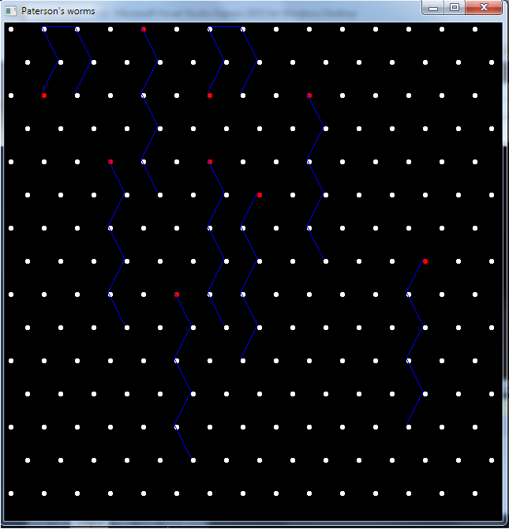
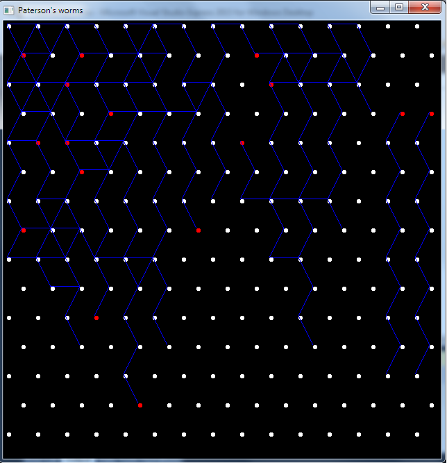

# PatersonsWorms

This is a two dimentional turing machine. Contains grid of dots each of which can be conected with it's six nearby dots. On this grid are
placed worms. Each worm moves from dot to her nearby dot and makes path between the dots. If a worm is on a dot which is connected with all
it's nearby dots, the worm dies.

# Start the simulation

With left click on a white dot, it's color changes to red and a worm is placed. With right click on a red dot, it's color changes to white
and the worm is deleted. When the "s" keyboard key is pressed, the simulation starts. And when the "a" keyboard key is pressed, the
simulation stops and all paths are deleted. Only the worms stays on the grid and with left and right clicks worms can be added or deleted.

 
